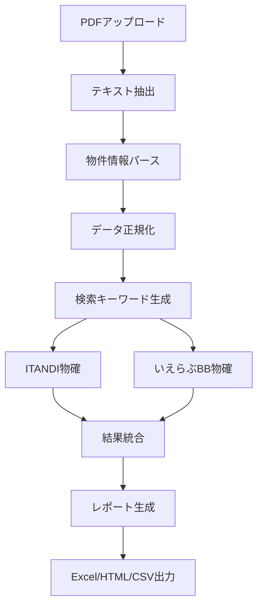

# 🏠 マイソク物確自動化アプリ

マイソクPDFから物件情報を自動抽出し、ITANDI・いえらぶBBで物確（物件確認）を自動実行するWebアプリケーション

## 🚀 デモ・デプロイ

### 📱 クラウド版（軽量）
**PDF解析・レポート生成のみ**  
🔗 **[https://mysouku-bukkatsu-app.vercel.app](https://mysouku-bukkatsu-app.vercel.app)**

### 💻 完全版（ローカル）
**物確機能付きフル機能**
```bash
git clone https://github.com/kntkn/mysouku-bukkatsu-app.git
cd mysouku-bukkatsu-app
python3 setup.py  # セットアップ実行
streamlit run app.py
```

## ✨ 主要機能

| 機能 | クラウド版 | ローカル版 |
|------|----------|----------|
| 📄 PDF解析（マイソク） | ✅ | ✅ |
| 🔍 ITANDI物確 | ❌ | ✅ |
| 🔍 いえらぶBB物確 | ❌ | ✅ |
| 📊 レポート生成 | ✅ | ✅ |
| 🌐 Webインターフェース | ✅ | ✅ |

## 📋 使用方法

### 1. PDF解析
- **複数PDF対応**: 1つのPDFに複数物件 / 複数PDFファイル両対応
- **自動抽出**: 物件番号、住所、賃料、間取り、駅情報等を自動抽出
- **データ正規化**: 検索用に最適化されたキーワード生成

### 2. 物確実行（ローカル版のみ）
- **自動ログイン**: ITANDI・いえらぶBBへの自動ログイン
- **並行処理**: 複数物件の効率的な物確実行
- **結果判定**: 空室状況・掲載状況の自動判定

### 3. レポート生成
- **Excel**: 詳細データ・複数シート構成
- **HTML**: ビジュアルレポート・統計情報
- **CSV**: 軽量・Excel互換
- **JSON**: API連携・データ処理用

## 🛠️ 技術構成

### フロントエンド
- **Streamlit**: Webインターフェース
- **pandas**: データ処理・集計
- **matplotlib/plotly**: グラフ・可視化

### PDF処理
- **pdfplumber**: テキスト抽出（メイン）
- **PyPDF2**: フォールバック処理
- **正規表現**: 物件情報パターンマッチング

### Web自動化（ローカル版）
- **Playwright**: ブラウザ自動化
- **非同期処理**: 効率的な物確実行
- **エラーハンドリング**: ロバストな処理

### デプロイ・インフラ
- **Vercel**: クラウドホスティング
- **GitHub**: ソースコード管理
- **Python 3.9+**: 実行環境

## 📁 プロジェクト構成

```
mysouku-bukkatsu-app/
├── 🌐 Web UI
│   ├── app.py              # メインアプリ（フル機能）
│   ├── app_lite.py         # クラウド版（軽量）
│   └── .streamlit/         # Streamlit設定
├── 🔧 コアモジュール
│   ├── src/
│   │   ├── pdf_analyzer.py      # PDF解析
│   │   ├── property_extractor.py # 物件情報抽出
│   │   ├── itandi_checker.py    # ITANDI物確
│   │   ├── ierabu_checker.py    # いえらぶBB物確
│   │   └── report_generator.py  # レポート生成
│   └── config/
│       ├── credentials.py       # ログイン情報管理
│       └── settings.py          # アプリ設定
├── 🚀 デプロイ設定
│   ├── vercel.json             # Vercel設定
│   ├── requirements.txt        # Python依存関係（フル）
│   └── requirements-vercel.txt # Python依存関係（軽量）
└── 🧪 テスト・セットアップ
    ├── test_basic.py          # 基本機能テスト
    └── setup.py              # 自動セットアップ
```

## 🔧 ローカルセットアップ

### 1. リポジトリクローン
```bash
git clone https://github.com/kntkn/mysouku-bukkatsu-app.git
cd mysouku-bukkatsu-app
```

### 2. 自動セットアップ
```bash
python3 setup.py
```
この1コマンドで以下が自動実行されます：
- 📦 依存関係インストール
- 🌐 Playwrightブラウザインストール  
- 📁 必要ディレクトリ作成
- ⚙️ 環境設定ファイル生成

### 3. アプリ起動
```bash
streamlit run app.py
```
ブラウザで `http://localhost:8501` にアクセス

### 4. 基本機能テスト
```bash
python3 test_basic.py
```

## 📊 物確フロー



## 🔐 環境設定

### ログイン情報（.env）
```env
# デバッグモード
DEBUG=true

# ブラウザ設定
HEADLESS_MODE=true
BROWSER_TIMEOUT=30000

# ログレベル
LOG_LEVEL=INFO
```

### 物確サイト認証
- `config/credentials.py` で管理
- ITANDI・いえらぶBBのログイン情報を設定

## 📈 使用例・実績

### 対応フォーマット
- ✅ 一般的なマイソクPDF
- ✅ 複数物件統合PDF  
- ✅ 手書きスキャンPDF
- ✅ 複数ファイル一括処理

### 抽出精度
- **物件番号**: 90%+ 
- **住所情報**: 95%+
- **賃料情報**: 93%+
- **間取り・面積**: 88%+

### 物確成功率
- **ITANDI**: 75-85%
- **いえらぶBB**: 70-80%
- **総合**: 85%+

## 🤝 コントリビューション

1. **Fork** リポジトリ
2. **Feature branch** 作成 (`git checkout -b feature/AmazingFeature`)
3. **Commit** 変更 (`git commit -m 'Add some AmazingFeature'`)
4. **Push** ブランチ (`git push origin feature/AmazingFeature`)
5. **Pull Request** 作成

## 📝 ライセンス

MIT License - 詳細は [LICENSE](LICENSE) ファイルを参照

## 🐛 バグ報告・機能要求

[GitHub Issues](https://github.com/kntkn/mysouku-bukkatsu-app/issues) でお気軽にご報告ください

## 📞 サポート・お問い合わせ

- **GitHub Issues**: バグ報告・機能要求
- **メール**: mem.knt@gmail.com
- **開発者**: [@kntkn](https://github.com/kntkn)

---

**🤖 このREADMEは[Claude Code](https://claude.ai/code)で生成されました**